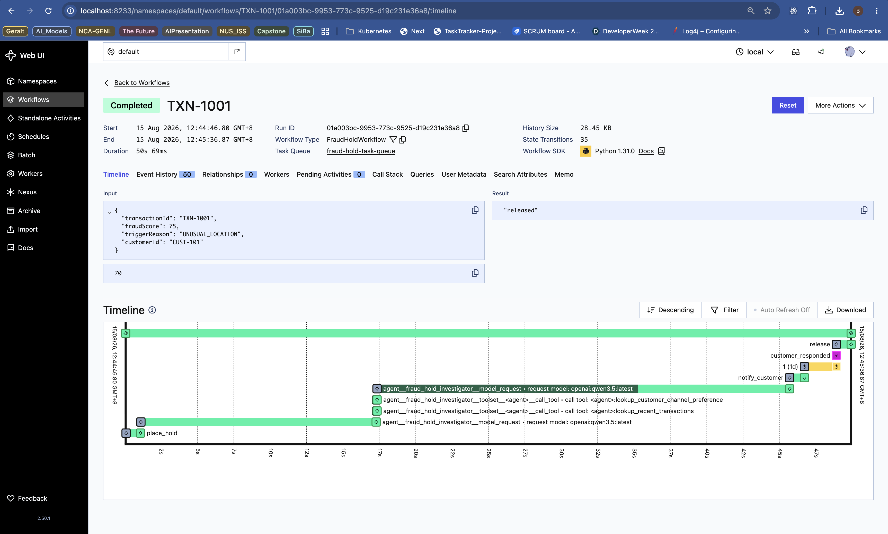
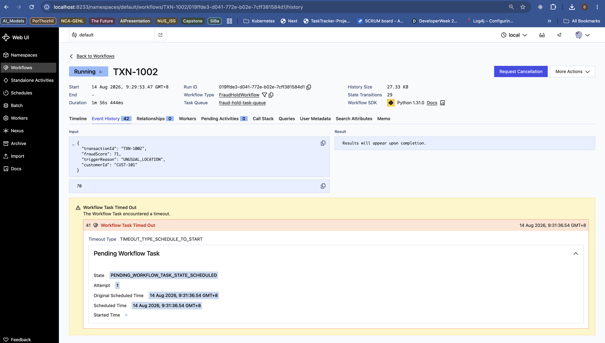
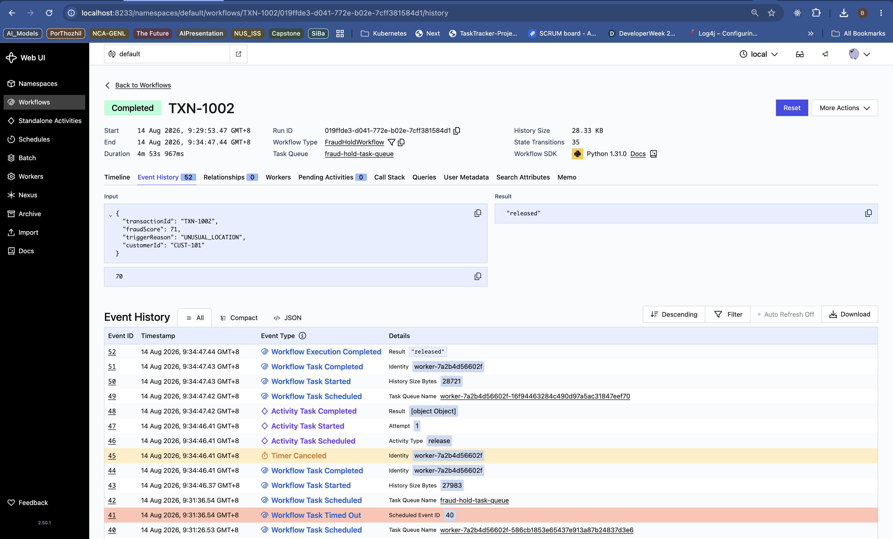
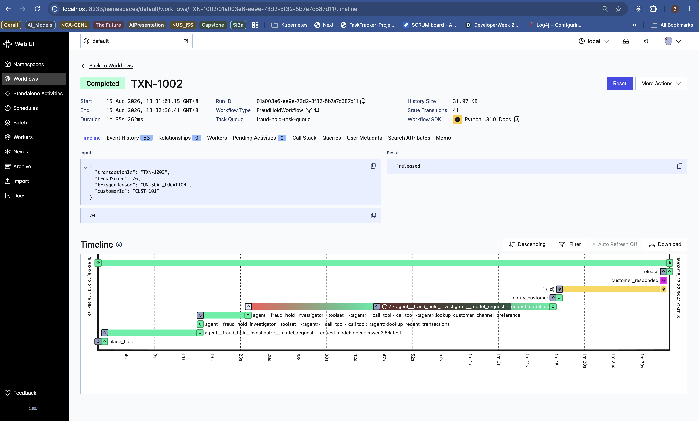
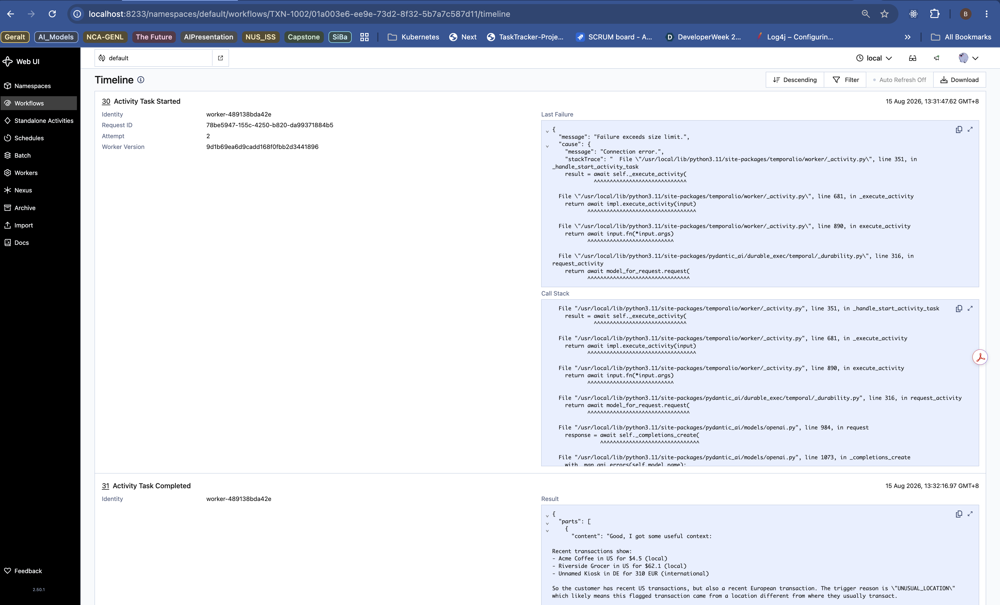
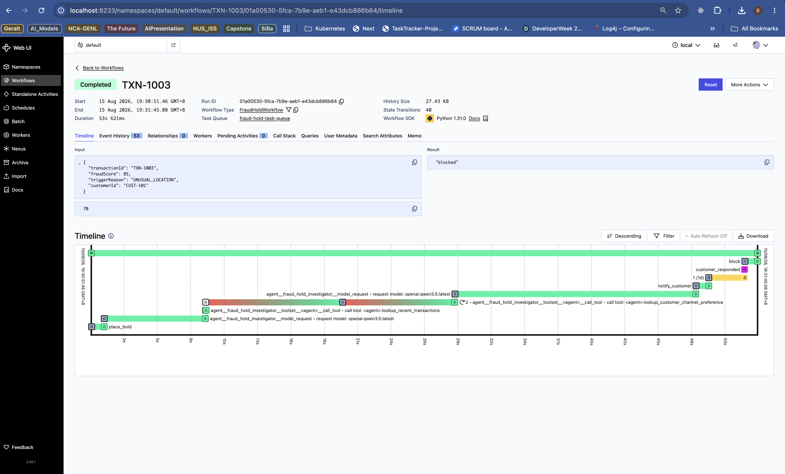
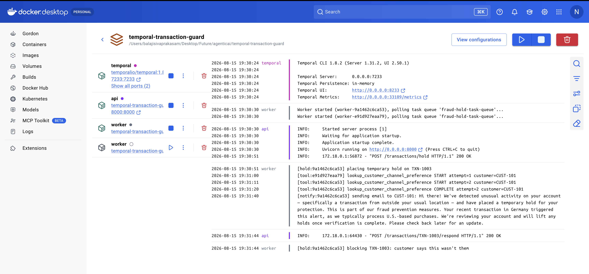

# temporal-transaction-guard

[](https://github.com/sivabalaji1986/temporal-transaction-guard/actions/workflows/tests.yml) [](LICENSE) [](https://www.python.org/) [](https://temporal.io/) [](https://ai.pydantic.dev/)

A durable **hold → investigate → notify → wait → resolve** workflow for suspicious transactions, built on [Temporal](https://temporal.io), [FastAPI](https://fastapi.tiangolo.com), a tool-using [PydanticAI](https://ai.pydantic.dev) Agent running through PydanticAI's `TemporalDurability` capability, and a local [Ollama](https://ollama.com) model.

This README covers install/run/demo instructions. For a from-scratch, file-by-file walkthrough of how the code works (aimed at readers new to Python or this codebase), see [`docs/LEARNING_GUIDE.md`](docs/LEARNING_GUIDE.md).

> **Agentic investigation, deterministic action.** The AI Agent may autonomously gather additional read-only context before writing its explanation, but it never decides whether to hold, release, block, or escalate a transaction — that stays entirely in the Temporal Workflow.

> **Fine-grained durability.** The Agent's `agent.run(...)` call executes directly inside the Workflow. Each individual model request and each individual tool call becomes its own Temporal Activity, separately recorded in Event History — not one opaque Activity containing the whole investigation. A Worker failure partway through an investigation does not force the whole thing to restart: whatever model/tool steps already completed are preserved and are not re-executed on resume, only the interrupted step retries.

> **What this project is *not*:** a fraud-detection engine. An upstream fraud engine doesn't send us every transaction — it identifies candidate transactions that may require further action and hands each one to us with a `fraudScore`, `triggerReason`, and `customerId`. We don't recompute or second-guess that score; we apply a simple deterministic hold policy on top of it (hold if the score is at/above a configured threshold, otherwise don't) and handle what happens *after* that decision: placing a hold, explaining it to the customer, waiting durably for a response, and resolving the case — correctly, even if a server crashes in the middle.

---

## Why this exists

Most fraud-hold logic is written as request/response code: check a score, call an API, maybe write a row to a database saying "waiting for customer." That approach has a real weakness — if the process crashes while a hold is open and a customer is expected to respond hours or days later, someone has to rebuild "where was this case?" by hand from whatever state made it to the database.

Temporal removes that problem. A workflow's progress is recorded as an event history on the Temporal server, not just in your process's memory. If the worker process dies — mid-hold, mid-wait, doesn't matter — a new worker can pick the workflow back up and continue exactly where it left off, with no lost cases and no re-deciding what already happened. (This is a guarantee about the *workflow's* durable progress and correct replay, not about individual activities — those are at-least-once and can legitimately retry, so a real hold/release/notify integration still needs to be idempotent on its own.)

This repo is a small, runnable demonstration of that guarantee, applied to a believable banking scenario.

---

## Architecture

```
Upstream fraud engine identifies a candidate transaction
        |
        v
POST /transactions/hold  (FastAPI)
        |                              <- resubmitting the same transaction_id
        v                                 (still running OR already completed)
FastAPI starts FraudHoldWorkflow          returns {"status": "already_started"}
(Temporal client call)                    instead of starting a duplicate
        |
        v
Deterministic threshold check          <- pure workflow logic, NOT an activity
        |
   -----+-----------------------------------
   |                                        |
no hold needed                        hold needed
   |                                        |
   v                                        v
Record no-hold outcome              Place temporary hold (Activity)
(Activity) -> workflow completes    <- funds are protected first; this
                                        must not wait on the LLM below
                                                |
                                                v
                                     agent.run(...) -- executes directly in
                                     Workflow code (PydanticAIWorkflow +
                                     TemporalDurability), fanning out into
                                     separate Temporal Activities:
                                        Model request Activity (turn 1)
                                                |
                                                v
                                        Tool call Activity(s), 0+ of:
                                        - lookup_recent_transactions()
                                        - lookup_customer_channel_
                                          preference()
                                          (both read-only, mocked; the
                                           Agent decides if/when to call
                                           them, bounded by an explicit
                                           request/tool-call limit)
                                                |
                                                v
                                        Model request Activity (final turn)
                                        -> InvestigationSummary: customer-
                                           friendly explanation, operations
                                           summary, notification type
                                     <- each of these is an independently
                                        durable Activity: if one fails and
                                        retries, already-completed earlier
                                        steps are NOT re-executed
                                     <- falls back to a fixed, deterministic
                                        explanation instead of failing the
                                        workflow if the Agent fails after
                                        retries (e.g. Ollama is unreachable,
                                        or the Agent's execution bound is
                                        hit)
                                                |
                                                v
                                     Notify customer (Activity)
                                                |
                                                v
                                     Wait for signal, 24h timeout
                                     (durable — holds no thread/memory)
                                     <- POST /transactions/{id}/respond
                                        returns 404 for an unknown or
                                        already-resolved transaction_id
                                                |
                        ------------------------------------------------
                        |                       |                      |
                 "It was me"              no response in 24h      "Not me"
                        |                       |                      |
                        v                       v                      v
                     Release                Escalate for review     Block
```

### Design rules this project follows

- **The threshold check lives inside the Workflow, not an Activity.** It's pure logic over data already in workflow memory — no external call, no non-determinism — so it's safe to replay.
- **Everything that touches the outside world is an Activity:** every LLM request, every tool call, placing a hold, sending a notification, releasing/blocking funds, logging the no-hold outcome. Activities are the only things that can fail, retry, and have side effects. `agent.run(...)` itself executes as Workflow code, but every piece of actual I/O it does is wrapped in its own Activity by `TemporalDurability` — the Workflow code stays deterministic.
- **Agentic investigation, deterministic action.** The PydanticAI Agent (`app/activities/generate_explanation.py`) may call two read-only tools — `lookup_recent_transactions` and `lookup_customer_channel_preference` — to gather extra context about the customer before writing its response. It decides for itself whether, and in what order, to call them. What it can **never** do is decide whether to hold, release, block, or escalate, recompute the fraud score, or call a write-side/banking tool — those stay entirely in the Workflow and its other Activities. This keeps the demo focused on durable orchestration around a genuinely agentic AI component, without letting the AI touch anything that actually moves money.
- **The Agent has a stable, explicit name (`fraud_hold_investigator`), and its built-in tool registry has a stable, framework-fixed ID (`<agent>`).** Both become part of the Temporal Activity names in-flight Workflow histories depend on (e.g. `agent__fraud_hold_investigator__model_request`) — treat them as durable contracts, not casually renameable. See `AGENTS.md`.
- **The Agent uses PydanticAI’s current `TemporalDurability` capability through `capabilities=[TemporalDurability(...)]` on a regular Agent**.
- **The Agent's tools stay read-only.** Because each model request and each tool call is now its own Temporal Activity, a retry only re-runs the *one* step that failed — not the whole investigation. That's still only safe because the tools are read-only and naturally idempotent (looking up the same customer's data twice has no side effect); a future tool with a real side effect would need careful thought, not just "add another `@_agent.tool`."
- **The Agent's tool-calling loop is explicitly bounded**, not left to run indefinitely. `generate_explanation.py` passes `usage_limits=UsageLimits(request_limit=6, tool_calls_limit=4)` to the Agent run — roughly double the normal path's expected 3 requests / 2 tool calls, but still far short of unbounded. Each individual model/tool Activity also has an explicit, bounded `start_to_close_timeout` and `retry_policy` (Temporal's own default retry policy is *unlimited* attempts, so this has to be set explicitly) — see [Timeout and retry budget](#timeout-and-retry-budget) below for the full worst-case calculation. Exceeding the usage-limits bound is just another Agent failure, handled by the same deterministic fallback described below.
- **Customer-facing text must summarize, not leak, internal context.** The Agent's system prompt explicitly instructs it to turn whatever it gathers (recent transactions, channel preference, the raw trigger reason) into a plain-language `customer_explanation` — never to paste raw tool output or internal identifiers into it. `ops_summary` is the place for more internal detail.

### Timeout and retry budget

Every model-request and tool-call Activity has an explicit `start_to_close_timeout` and `retry_policy` (`generate_explanation.py`'s `_BASE_ACTIVITY_CONFIG`/`_MODEL_ACTIVITY_CONFIG`), chosen deliberately rather than left on Temporal's default (unlimited attempts):

| | `start_to_close_timeout` | `maximum_attempts` |
|---|---|---|
| Model-request Activity | 60s | 2 |
| Tool-call Activity | 10s | 2 |

**Worst-case Agent-phase budget** (the maximum path permitted by `UsageLimits(request_limit=6, tool_calls_limit=4)`, assuming every single invocation fails once and retries):
- Model: 6 × (60s + 1s backoff + 60s) = 726s
- Tools: 4 × (10s + 1s backoff + 10s) = 84s
- **Total: 810s**, comfortably under a 900s (15 minute) ceiling.

The 60s model-request timeout isn't a guess: real local measurement (this repo's configured default, `qwen3.5:latest`, forced to a genuine cold start, with the actual system prompt and tool schemas) showed a worst observed latency of **17.1 seconds** across multiple trials — 60s gives roughly 3.5x headroom over that. Two attempts per individual step is a deliberate tradeoff that still adds up to substantial aggregate retry coverage across a full investigation: up to 6 × 2 = 12 possible model-request attempts and 4 × 2 = 8 possible tool-call attempts across a single run, even though any one step only gets two attempts of its own.

If you change `UsageLimits` or either activity config, recalculate this budget — don't just widen a number without checking the total.

The `1s backoff` in the model-request calculation above is configurable via `DEMO_MODEL_RETRY_INTERVAL_SECONDS` (default `1`, matching the math above) — a demo/observability knob, like `DEMO_FAILOVER_DELAY_SECONDS` below, not something to widen for routine use. Raising it raises the 810s total and requires recalculating the same way. Because `Settings` reads `.env` from the current working directory, leaving either `DEMO_*` variable set locally after a demo also affects a native `pytest tests/` run, not just the running app — reset both to `0`/`1` when you're done.

**Hand-written side-effect Activities** (`place_hold`, `release`, `block`, `escalate`, `notify_customer`, `record_no_hold_outcome`) are separate from the Agent-phase budget above — they're not part of the 810s figure, and changing them doesn't affect it — but they also no longer rely on Temporal's default unlimited retry policy. `fraud_hold_workflow.py` gives each of them an explicit `retry_policy=_SIDE_EFFECT_RETRY_POLICY` (`maximum_attempts=2`, 1-second initial backoff), alongside their existing 10-second `start_to_close_timeout`. This bounds how long the Workflow will keep retrying a failing side effect instead of retrying it forever — it does **not** make these Activities exactly-once. Temporal Activities are at-least-once regardless of retry policy, so a real (non-mocked) downstream integration still needs its own idempotency key — e.g. `f"{transaction_id}:HOLD"` / `f"{transaction_id}:RELEASE"` / `f"{transaction_id}:BLOCK"` / `f"{transaction_id}:ESCALATE"` — bounding the retry count only stops the Workflow from waiting on a failing side effect forever, it doesn't dedupe the effect itself.

If you have stale local Temporal dev-server state, wipe it (`docker compose down -v`) before running this project — this is a small demo repo, so a clean-slate restart is the deliberate approach rather than a production-grade versioning strategy.

### How this shows up in Temporal's Event History

Open any workflow in the Temporal Web UI (`http://localhost:8233`) and click its **Event History** tab, and you'll see a repeating pattern rather than one line per activity. That's expected — here's how to read it:

- **Workflow Task** — the worker waking up to run/replay `FraudHoldWorkflow.run` up to its next decision point, then going back to sleep. Every activity call (including each individual model/tool call the Agent makes), every signal, and the timer firing/being canceled each trigger one of these. Recorded as 3 events: `WorkflowTaskScheduled` → `WorkflowTaskStarted` → `WorkflowTaskCompleted`.
- **Activity Task** — the actual execution of one activity. Most are familiar (`place_hold`, `notify_customer`, `release`/`block`/`escalate`), and the Agent investigation fans out into several, individually named and individually tracked: `agent__fraud_hold_investigator__model_request` (once per model turn — typically twice: decide whether to call a tool, then produce the final structured output) and `agent__fraud_hold_investigator__toolset__<agent>__call_tool` (once per tool call the Agent actually makes, zero or more). Each is 3 events — `ActivityTaskScheduled` → `ActivityTaskStarted` → `ActivityTaskCompleted` — plus one extra `ActivityTaskStarted` per retry attempt if it fails and gets retried (check the `Attempt` field, and `Last Failure` on that event for why the previous attempt didn't succeed, and the `Identity` field for which Worker container handled it — see [Demo C](#demo-c--cross-worker-failover-during-durable-agent-execution)).
- **Timer** — the durable 24h wait: `TimerStarted` when `wait_condition`'s timeout kicks in, then either `TimerCanceled` (a signal arrived first) or `TimerFired` (24h passed with no response).
- **Signal** — `WorkflowExecutionSignaled` the moment `/respond` (or `send_signal.py`) delivers `customer_responded`.
- **Completion** — `WorkflowExecutionCompleted`, the terminal event, carrying the final result string.

Stacked together, an above-threshold hold that gets resolved via signal looks like this:

```
WorkflowExecutionStarted
  Workflow Task  -> decide: call place_hold
  Activity Task: place_hold
  Workflow Task  -> decide: model request (turn 1: decide whether to call a tool)
  Activity Task: agent__fraud_hold_investigator__model_request
  Workflow Task  -> decide: call a tool
  Activity Task: agent__fraud_hold_investigator__toolset__<agent>__call_tool
  Workflow Task  -> decide: model request (final turn: produce InvestigationSummary)
  Activity Task: agent__fraud_hold_investigator__model_request
  Workflow Task  -> decide: call notify_customer
  Activity Task: notify_customer
  Workflow Task  -> decide: start the 24h wait
  TimerStarted
  ...workflow durably parked here -- no thread, no process, just this
     recorded state -- until one of the two below happens...
  WorkflowExecutionSignaled (customer_responded)   <- or TimerFired, if 24h passes first
  Workflow Task  -> decide: signal arrived, cancel the timer, call release/block
  TimerCanceled
  Activity Task: release  (or: block)
  Workflow Task  -> decide: return the result
  WorkflowExecutionCompleted ("released")
```

Since each "Workflow Task" and "Activity Task" line above is really 3 history events, a single resolved hold typically ends up as ~45-55 total events, since the investigation fans out into several separately tracked Activities rather than a single one. That's normal, not a sign anything's wrong — every one of those events is a durability checkpoint permanently recorded by the Temporal *server*, independent of the worker process. That's exactly why killing and restarting the worker mid-hold (see [Demo A](#demo-a--business-workflow-durability) and [Demo C](#demo-c--cross-worker-failover-during-durable-agent-execution) below) doesn't lose any progress: a new worker just picks up where this history left off.

---

## Components

| Component | Role |
|---|---|
| **FastAPI (`app/main.py`)** | Entry and exit point. `POST /transactions/hold` receives the handoff from the fraud engine and starts a workflow — resubmitting the same `transaction_id` (whether still running or already completed) returns `{"status": "already_started"}` instead of starting a duplicate. `POST /transactions/{id}/respond` delivers the customer's response as a Temporal Signal, returning a 404 if `transaction_id` doesn't match a known workflow. |
| **Workflow (`app/workflows/fraud_hold_workflow.py`)** | Orchestrates the whole case: threshold check, activity calls, the durable wait with timeout, and the final branch (release / block / escalate). |
| **Activities (`app/activities/`)** | `generate_explanation.py` defines the PydanticAI Agent (talking to Ollama, `capabilities=[TemporalDurability(...)]`) and its two read-only mock tools — its model requests and tool calls become Temporal Activities automatically, not via a hand-written `@activity.defn` wrapper. Falls back to a fixed explanation instead of failing the workflow if the investigation fails after retries. `hold.py` (place hold / release / block / escalate), `notify.py` (customer notification), `log_outcome.py` (no-hold logging) are plain, hand-written Activities. All mocked for the demo — swap in real integrations later. |
| **Worker (`app/worker.py`)** | Connects to the Temporal server (with `plugins=[PydanticAIPlugin()]`, and an explicit `identity=` built from the container hostname), registers the workflow and its plain activities, and executes tasks from the queue. `PydanticAIPlugin` auto-registers the Agent's model/tool activities by reading `FraudHoldWorkflow.__pydantic_ai_agents__` — no manual registration needed for those. This is the process we deliberately kill mid-demo (Demo A and Demo C below) — and the one you scale to 2 replicas for Demo C. |
| **`scripts/send_signal.py`** | Simulates a customer replying, independent of the FastAPI process — useful for testing signal delivery directly. |

---

## Repository structure

```
temporal-transaction-guard/
├── requirements.txt
├── requirements-dev.txt
├── ruff.toml
├── docker-compose.yml
├── Dockerfile
├── .env.example
├── pytest.ini
├── LICENSE
├── AGENTS.md
├── .github/
│   └── workflows/
│       └── tests.yml
├── docs/
│   └── LEARNING_GUIDE.md                  # File-by-file walkthrough for readers new to Python/this codebase
├── screenshots/
│   ├── SuccessWorkflow.png                # Baseline: a full successful fraud-hold run
│   ├── demoa_1.png                        # Demo A: Signal recorded while Worker is down
│   ├── demoa_2.png                        # Demo A: resumed and completed after Worker returns
│   ├── demob_1.png                        # Demo B: model-request retry in the Timeline view
│   ├── demob_2.png                        # Demo B: Attempt 2 detail (failure + successful retry)
│   ├── democ_1.png                        # Demo C: cross-Worker tool retry in the Timeline view
│   └── democ_2.png                        # Demo C: Worker A -> Worker B handoff in the logs
├── app/
│   ├── main.py
│   ├── models.py
│   ├── config.py
│   ├── worker.py
│   ├── workflows/
│   │   └── fraud_hold_workflow.py         # PydanticAIWorkflow + __pydantic_ai_agents__
│   └── activities/
│       ├── generate_explanation.py        # Agent + TemporalDurability + tools
│       ├── hold.py
│       ├── notify.py
│       └── log_outcome.py
├── scripts/
│   └── send_signal.py
└── tests/
    ├── test_fraud_hold_workflow.py              # Workflow-level: monkeypatch + UnsandboxedWorkflowRunner
    ├── test_generate_explanation_agent.py       # Agent-level, outside a Workflow (transparent)
    └── test_generate_explanation_agent_durability.py  # fine-grained Activity fan-out + replay
```

---

## Input contract

The upstream fraud engine doesn't hand us every transaction — only candidate transactions it flags as potentially needing further action, sent like this:

```json
{
  "transactionId": "TXN-1001",
  "fraudScore": 78,
  "triggerReason": "UNUSUAL_LOCATION",
  "customerId": "CUST-101"
}
```

`fraudScore` and `triggerReason` are treated as facts from an external system — this project doesn't recompute or second-guess the score itself. What it *does* decide, independently, is whether that score clears our own configured hold threshold; see [Architecture](#architecture) for that check.

---

## Setup and Verification

Get the repo ready to work with, and confirm it's in a working state, before running anything that needs Temporal, Docker, or Ollama.

1. Clone the repo:

   ```bash
   git clone https://github.com/sivabalaji1986/temporal-transaction-guard.git
   cd temporal-transaction-guard
   ```

2. Create and activate a persistent virtual environment. This is **not** the same as a throwaway venv you might spin up just to run a one-off command — this one is meant to stay for ongoing work in the repo:

   ```bash
   python3 -m venv .venv
   source .venv/bin/activate      # Windows PowerShell: .venv\Scripts\Activate.ps1
   ```

   `.venv` is gitignored and won't exist after a fresh clone — this step is required every time you clone the repo. If you skip it, `source .venv/bin/activate` will fail with "no such file or directory."

3. Install pinned dependencies:

   ```bash
   pip install -r requirements.txt
   ```

4. Run the test suite. This does **not** require Temporal, Docker, or Ollama to be running — all 16 tests use mocked activities, Temporal's in-memory time-skipping test environment, `UnsandboxedWorkflowRunner` where needed for monkeypatching, and PydanticAI's deterministic `TestModel`/`FunctionModel` test doubles instead of a real Ollama call:

   ```bash
   pytest tests/ -v
   ```

   Expected: `16 passed` across three files:
   - `tests/test_fraud_hold_workflow.py` (6) — Workflow-level orchestration against the *real* `FraudHoldWorkflow`, with a test Agent substituted in via `monkeypatch` + `UnsandboxedWorkflowRunner`, including a test proving the hand-written Activities' bounded retry policy is actually in effect.
   - `tests/test_generate_explanation_agent.py` (7) — Agent-level, called outside a Workflow (where `TemporalDurability` is transparent): tool registration/calling, real tool-return-value influence, customer-scoped tool data via `ctx.deps`, invalid-output rejection, no raw-data leakage, the bounded tool-calling loop.
   - `tests/test_generate_explanation_agent_durability.py` (3) — the fine-grained durability boundary itself: a completed tool Activity is proven *not* re-executed when a later model step fails and retries (verified via both an invocation counter and Temporal's own Event History), the usage-limits bound through the real Activity boundary, and a `Replayer`-based replay-determinism check.

   If you instead see `ModuleNotFoundError: No module named 'temporalio'`, you're running `pytest` with a different Python than the one in `.venv` — check that `which python3` and `which pytest` both point inside `.venv/bin` (a common cause is running `pytest` via a system or IDE-default Python instead of the activated venv).

5. Copy the example environment file:

   ```bash
   cp .env.example .env        # Windows PowerShell: Copy-Item .env.example .env
   ```

   The Ollama and Temporal environment variables referenced throughout this README (`OLLAMA_BASE_URL`, `OLLAMA_MODEL`, `TEMPORAL_ADDRESS`, etc.) won't take effect until this file exists — `.env.example` is a template, not something the app reads directly.

6. Confirm Ollama is running and has a model pulled:

   ```bash
   # Ollama needs to be running before you can pull a model or use the app.
   # On Mac, the Ollama desktop app already runs this in the background --
   # only run it manually (e.g. on Linux, or if `ollama list` below fails
   # to connect) if it's not already running. `ollama serve` runs in the
   # foreground and blocks, so give it its own terminal (or start it as a
   # background service) -- running the commands below in that same
   # terminal would just hang waiting for `ollama serve` to return:
   ollama serve

   # (in a separate terminal, once ollama serve is running)
   ollama pull qwen3.5:latest
   ollama list
   curl http://localhost:11434/api/tags
   ```

   `ollama list` and the `curl` should both show `qwen3.5:latest` (or whatever you set `OLLAMA_MODEL` to) once it's pulled. If either fails to connect instead, Ollama isn't running yet — run `ollama serve` above first.

7. Only after tests pass, proceed to "Running locally" below to actually run the app — that part does require Temporal (via Docker) and Ollama.

---

## Running locally

Note: if you have stale local Temporal dev-server state, wipe it first — see [Timeout and retry budget](#timeout-and-retry-budget) for details.

### Prerequisites

- [Docker](https://www.docker.com/) — bundles its own Temporal dev server, so no separate Temporal CLI install is needed
- [Ollama](https://ollama.com) running on your **host machine** (not inside Docker) with a model pulled, e.g. `ollama pull qwen3.5:latest`

(See [Setup and Verification](#setup-and-verification) above if you haven't already created a virtual environment and confirmed tests pass.)

### Start the stack

```bash
docker compose up --build
```

This brings up:
- a Temporal dev server (with its Web UI at `http://localhost:8233`)
- the FastAPI app (`http://localhost:8000`)
- a Temporal worker

Ollama is expected to run on your **host machine**, not inside Docker — the worker container talks to it via `http://host.docker.internal:11434/v1` (already wired into `docker-compose.yml`). This avoids bundling model weights into the container and lets you swap models without rebuilding.

To run **two** Worker replicas polling the same task queue (needed for [Demo C](#demo-c--cross-worker-failover-during-durable-agent-execution)):

```bash
docker compose up --build --scale worker=2
```

No changes to `docker-compose.yml` are needed for this — the `worker` service has no `container_name` and no fixed host port, which are the two things that would otherwise block scaling it. Each replica gets its own container hostname, which is what makes it possible to tell them apart in logs and in the Temporal Web UI's Event History (see `app/worker.py`'s `identity=`).

### Verify it's running

```bash
docker compose ps              # temporal, api, worker should all show as Up
docker compose logs -f worker  # look for "Worker started (worker-<hostname>), polling task queue..."
```

Then open `http://localhost:8233` in your browser for the Temporal Web UI, and `http://localhost:8000/docs` for FastAPI's interactive docs.

There's no `/health` endpoint on the API today — `/docs` (FastAPI's built-in Swagger UI, on by default) is the honest way to confirm it's responding without one. A dedicated health-check endpoint would be a reasonable future addition, but that's out of scope for this doc-only pass.

### Connecting to Ollama

Set these in `.env` (see `.env.example`):

```
OLLAMA_BASE_URL=http://localhost:11434/v1
OLLAMA_MODEL=qwen3.5:latest
```

The PydanticAI Agent in `generate_explanation.py` uses PydanticAI's OpenAI-compatible provider pointed at Ollama's local endpoint — no external API key, no data leaving your machine.

---

## Triggering the flow

```bash
curl -X POST http://localhost:8000/transactions/hold \
  -H "Content-Type: application/json" \
  -d '{
    "transactionId": "TXN-1001",
    "fraudScore": 78,
    "triggerReason": "UNUSUAL_LOCATION",
    "customerId": "CUST-101"
  }'
```

Response:

```json
{"workflow_id":"TXN-1001","status":"started"}
```

Simulate the customer's reply (after notify_customer activity is executed):

```bash
curl -X POST http://localhost:8000/transactions/TXN-1001/respond \
  -H "Content-Type: application/json" \
  -d '{"response": "it_was_me"}'
```

Response:

```json
{"status":"signal_sent"}
```



*Successful fraud-hold Workflow. The temporary hold is placed first; the PydanticAI Agent then executes through separate model-request and read-only tool Activities, followed by notification, durable waiting, customer response, and final resolution.*

### More examples

A transaction below the fraud-score threshold (default `70`, see `FRAUD_SCORE_THRESHOLD` in `.env.example`) — the response shape is identical to a held transaction; the difference (no hold placed, no notification sent) only shows up in the worker's logs or the Temporal Web UI, not in this response:

```bash
curl -X POST http://localhost:8000/transactions/hold \
  -H "Content-Type: application/json" \
  -d '{"transactionId": "TXN-2001", "fraudScore": 40, "triggerReason": "MINOR_ANOMALY", "customerId": "CUST-202"}'
```

```json
{"workflow_id":"TXN-2001","status":"started"}
```

A `"not_me"` response — also `{"status":"signal_sent"}`, since this endpoint only confirms the signal was delivered; whether the workflow resolves to `release` or `block` isn't reflected here, only in the logs/Web UI:

```bash
curl -X POST http://localhost:8000/transactions/TXN-1001/respond \
  -H "Content-Type: application/json" \
  -d '{"response": "not_me"}'
```

Submitting the same `transaction_id` a second time (idempotency — see [Architecture](#architecture)):

```bash
curl -X POST http://localhost:8000/transactions/hold \
  -H "Content-Type: application/json" \
  -d '{"transactionId": "TXN-1001", "fraudScore": 78, "triggerReason": "UNUSUAL_LOCATION", "customerId": "CUST-101"}'
```

```json
{"workflow_id":"TXN-1001","status":"already_started"}
```

Responding to a `transaction_id` that was never submitted (or was already resolved):

```bash
curl -i -X POST http://localhost:8000/transactions/TXN-DOES-NOT-EXIST/respond \
  -H "Content-Type: application/json" \
  -d '{"response": "it_was_me"}'
```

```
HTTP/1.1 404 Not Found
```
```json
{"detail":"No transaction found for 'TXN-DOES-NOT-EXIST'"}
```

## Three durability demonstrations

These prove three distinct, related properties. Don't conflate them:

| | Proves | How |
|---|---|---|
| **Demo A** | The *business Workflow* survives a Worker crash while durably waiting for a customer. | Manual, below. |
| **Demo B** | Model/tool steps *inside* one Agent investigation are individually durable — a completed one isn't redone just because a later one fails. | Manual, using the Event History / Timeline in the Web UI. |
| **Demo C** | An in-flight Agent Activity survives a *different* Worker container being terminated mid-execution — not just a restart — and retries on a surviving replica; work already completed before the interruption is preserved. | Manual, using two Docker Worker replicas. |

Taken together: Temporal keeps the business Workflow durable across Worker failure and gives PydanticAI model/tool calls durable Activity boundaries. Completed Activities are preserved in history, while incomplete Activities can retry on another Worker.

### Demo A — Business Workflow durability

1. Start Temporal, the API, the worker, and Ollama (see [Running locally](#running-locally)).
2. Submit an above-threshold transaction (the `hold` curl example above).
3. Let `place_hold`, the Agent investigation, and `notify_customer` complete.
4. Confirm in the Temporal Web UI (`http://localhost:8233`) that the workflow is now durably waiting for the customer response — see [How this shows up in Temporal's Event History](#how-this-shows-up-in-temporals-event-history) above for how to read it.
5. Stop the worker (`docker compose stop worker`) — and leave it down.
6. While the worker is still down, send the customer response (the `respond` curl example above).
7. In the Web UI, confirm Temporal accepted and recorded the Signal, and that the workflow's status is still **Running**, not failed. You'll typically see a **Workflow Task Timed Out** event with `Timeout Type: TIMEOUT_TYPE_SCHEDULE_TO_START` — this is a *Workflow Task* timeout (no worker was available to pick up the next decision), not a Workflow execution failure. Temporal can accept and durably record a Signal even with zero workers running; nothing about the workflow's recorded state is affected by there being no worker to act on it yet.
8. Start the worker (`docker compose start worker`).
9. Watch the workflow resume: once a worker is available again, Temporal delivers the already-recorded history and Signal to it, the workflow replays/continues from exactly where it left off, cancels the wait timer, runs the resolution activity (`release`/`block`), and completes.



*Demo A — Worker unavailable, Workflow still durable. The customer Signal is recorded in Temporal while no Worker is available to execute the next Workflow Task. The UI shows a `SCHEDULE_TO_START` timeout, but the Workflow itself remains `Running`.*



*Demo A — Recovery after the Worker returns. Event History retains the earlier timeout and then shows resumed Workflow execution, timer cancellation, the resolution Activity, and final `WorkflowExecutionCompleted`.*

This is a stronger proof than merely restarting a worker while it's still polling: it shows Temporal accepting and durably recording a customer Signal with *no worker running at all*, and a worker picking that state back up later and completing the case correctly — no lost progress, even though nothing was running to react to the Signal when it arrived. (Temporal guarantees the workflow's durable progress and correct replay; it does not give activities exactly-once execution — they're at-least-once, so a real, non-mocked hold/release/block integration would need to be idempotent on its own, e.g. keyed by `transaction_id`.)

### Demo B — Fine-grained Agent durability

Fire the `hold` curl example above, then open the workflow's **Event History** in the Web UI (`http://localhost:8233`). You'll see the investigation broken into several separate Activity Task entries — `agent__fraud_hold_investigator__model_request` (once per model turn) and `agent__fraud_hold_investigator__toolset__<agent>__call_tool` (once per tool call actually made) — each independently scheduled, started, and completed. Each of those is its own durability checkpoint, recorded by the Temporal server the moment it completes, regardless of what happens afterward.

**Live demo, triggering a deliberate retry:** rather than waiting for a random Ollama connection hiccup, this demo deliberately stops the local Ollama server between Model Request 1 and Model Request 2, so the retry is reproducible on every run. `DEMO_MODEL_RETRY_INTERVAL_SECONDS` widens the retry backoff so you have a comfortable window to restart Ollama before the retry fires. Set it, temporarily, in `.env` before bringing the stack up (or export it before `docker compose up`):

```env
DEMO_MODEL_RETRY_INTERVAL_SECONDS=20
```

The normal default is `1`; `20` is only a temporary observability override for this demo. Confirm the Worker container actually received it (Docker only picks up a changed `.env` on a fresh `docker compose up`, not a container already running):

```bash
docker compose exec worker env | grep DEMO_MODEL
docker compose exec worker python -c "from app.config import settings; print(settings.demo_model_retry_interval_seconds)"
docker compose exec worker python -c "from app.activities.generate_explanation import _MODEL_ACTIVITY_CONFIG; print(_MODEL_ACTIVITY_CONFIG)"
```

With that confirmed, fire the `hold` curl example and watch the workflow's **Timeline** in the Web UI:

1. Let `Model Request 1` and both read-only tool Activities (`lookup_recent_transactions`, `lookup_customer_channel_preference`) complete.
2. As soon as `lookup_customer_channel_preference` shows completed, stop Ollama (see below) — before the Model Request 2 Activity starts.
3. Confirm the Model Request 2 Activity's attempt 1 fails, with `Last Failure` showing a connection error.
4. While the workflow sits in its 20-second retry backoff, restart Ollama (see below).
5. Confirm Model Request 2's attempt 2 succeeds.
6. Confirm `Model Request 1`, `lookup_recent_transactions`, and `lookup_customer_channel_preference` still show completed exactly once — none of them re-ran just because Model Request 2 failed and retried.

**Stopping/restarting Ollama** (it runs on your host machine, not inside Docker — see [Running locally](#running-locally)) is OS-dependent:

- **macOS/Windows desktop app:** quit Ollama from the menu bar / system tray icon, then reopen it. Don't use `ollama stop qwen3.5:latest` (or any `ollama stop <model>`) — that only unloads the model from memory and leaves the Ollama API server itself running, so the Activity would keep succeeding.
- **Linux, systemd install:** `sudo systemctl stop ollama` / `sudo systemctl start ollama`.
- **Started manually with `ollama serve`:** stop that process (`Ctrl+C` in its terminal), then run `ollama serve` again.

This is what the deliberate failure looks like in the Timeline:

```text
Model Request 1                     ✅
lookup_recent_transactions          ✅
lookup_customer_channel_preference  ✅
        ↓ stop Ollama
Model Request 2, attempt 1          ❌
        ↓ retry backoff (20s)
        ↓ restart Ollama
Model Request 2, attempt 2          ✅
```



*Demo B — Fine-grained Agent retry. The first model request and earlier read-only tool Activities complete once. A later model-request Activity retries, while the completed tool steps remain preserved.*



*Demo B — Retry of the same model-request Activity. Temporal shows `Attempt: 2` together with the previous model-call failure, followed by successful completion. The retry occurs at the failed model-request boundary rather than restarting the entire Agent investigation.*

This is what Demo B proves: Model Request 2 retries while the already-completed Model Request 1 and tool Activities (`lookup_recent_transactions`, `lookup_customer_channel_preference`) are preserved and not re-executed.

**Reset `DEMO_MODEL_RETRY_INTERVAL_SECONDS` to `1`** before using this stack for anything other than this specific demo.

### Demo C — Cross-Worker failover during durable Agent execution

Proves cross-Worker failover for an in-flight Agent Activity: when the Worker container executing it is terminated mid-execution — not just restarted (Demo A) — a *different*, surviving Worker container picks up the retry, using two Worker replicas polling the same task queue. Everything that completed *before* the interruption (here, the first model turn and the first tool call) is preserved from Event History rather than redone. This is related to, but distinct from, Demo B's specific claim: Demo B manually demonstrates a completed *tool* Activity surviving Model Request 2 failing and retrying, all on one Worker; Demo C proves an in-flight Activity itself can resume on *another* Worker after the original one is killed. Don't read Demo C as re-proving Demo B's exact scenario — it demonstrates the cross-Worker failover property specifically.

**Setup:**

```bash
docker compose up --build --scale worker=2
docker compose logs -f --timestamps worker   # watch both replicas' output, prefixed by container name
```

Each replica logs its own container hostname on startup (`Worker started (worker-<hostname>), polling task queue...`) and on every mocked-activity print line (`[hold:<hostname>] ...`, etc.) — that's how you'll tell them apart. `lookup_customer_channel_preference` additionally logs its own START/COMPLETE lines with the Activity's attempt number: `[tool:<hostname>] lookup_customer_channel_preference START attempt=1 customer=CUST-101`. `--timestamps` adds a wall-clock time to every line Docker prints — there's no timestamp logic in the application code itself, so this is the only thing that dates these lines.

**Make the interruption window reproducible**, rather than racing a live Ollama call's variable timing: set `DEMO_FAILOVER_DELAY_SECONDS=8` in `.env` before `docker compose up`. This adds a plain `asyncio.sleep(8)` inside the `lookup_customer_channel_preference` tool — the *second* of the Agent's two read-only tools, which the Agent typically calls in the same turn as the first — giving you a predictable window to identify and kill a Worker while a real Activity is genuinely in-flight. `8` is deliberately below the tool-call Activity's 10-second `start_to_close_timeout` (see [Timeout and retry budget](#timeout-and-retry-budget)): with the Worker left running normally, the delayed call still completes before its timeout and the Agent continues normally — the delay creates an interruption window, it doesn't force a timeout. Setting it above `10` would instead guarantee the Activity times out on its own, driving the Agent into its deterministic fallback regardless of whether a Worker is ever killed, which is not what this demo is meant to show. It's `0` (off) by default everywhere else, including every automated test, and it only ever delays this one already-read-only, already-idempotent Activity — it doesn't touch Workflow code, `customer_id` handling, or bypass `TemporalDurability` in any way.

> **Honest note on scope:** the interrupted/retried Activity in this reproducible demo is the second **tool** call, not the second **model** request. Delaying a specific model-request Activity would require patching PydanticAI's internal activity functions — private API, which this project deliberately avoids (see `AGENTS.md`). Delaying our own tool achieves the same underlying property with only public, documented mechanisms: an in-flight Agent Activity can recover from Worker death — the interrupted attempt does not complete, and Temporal retries the same logical Activity on another Worker — and whatever completed *before* it (here, the first model turn and the first tool call) is preserved and not re-executed.

**Sequence:**

1. Fire the `hold` curl example (above) with a fraud score at/above the threshold.
2. Watch the Worker logs (`docker compose logs -f --timestamps worker`): confirm `agent__fraud_hold_investigator__model_request` (turn 1) and `agent__fraud_hold_investigator__toolset__<agent>__call_tool` for `lookup_recent_transactions` have both completed (you can cross-check this in the Web UI's Event History too), then wait for a `[tool:<hostname>] lookup_customer_channel_preference START attempt=1 customer=...` log line — its hostname is "Worker A."
3. Stop Worker A specifically: `docker stop <worker-container-name>` — find the exact container name with `docker compose ps`. Use plain `docker stop`, not `docker compose stop`: Compose's `stop` targets a *service* (all its replicas), so `docker compose stop worker` would stop both Worker A and Worker B; `docker stop` takes a specific container name/ID, so it stops only the one replica you name.
4. Watch the logs: Worker B (the surviving replica) picks up the retry — a second `[tool:<hostname>] lookup_customer_channel_preference START attempt=2 customer=...` line appears, this time with Worker B's hostname, followed by its `COMPLETE` line. The Agent continues to its final model turn, which also runs on whichever Worker is free (commonly B).
5. The investigation completes normally: `InvestigationSummary` produced, customer notified, workflow durably waiting again.
6. Send the `respond` curl example — the workflow resolves (`release`/`block`) exactly as in Demo A.

```text
Worker A executes attempt 1
        ↓ Worker A is stopped
        ↓ attempt 1 does not complete
        ↓ Temporal records the failed/timed-out attempt
        ↓ the same logical Activity becomes retry-eligible
Worker B executes attempt 2
```



*Demo C — Cross-Worker retry visible in Temporal. The delayed `lookup_customer_channel_preference` tool Activity reaches a second attempt and the Workflow continues normally.*



*Demo C — Attempt 1 and attempt 2 executed by different Workers. `lookup_customer_channel_preference` starts with `attempt=1` on one Worker and never completes there; Temporal retries the same Activity on a different Worker, where `attempt=2` starts and completes successfully.*

**Worker logs and Event History prove two different halves of this — don't conflate them.** Worker logs establish the Worker-A → Worker-B handoff: they're what actually names which container ran attempt 1 and which container ran attempt 2. Temporal Event History establishes that the same logical Activity retried after the prior attempt failed and that Workflow execution continued from durable history — it doesn't, on its own, hand you a labeled "Worker A" / "Worker B" pair the way the logs do.

**Evidence to capture, in the Worker logs (`docker compose logs -f --timestamps worker`) — this is the direct proof of *which* container ran which attempt:**

- `[tool:<Worker A's hostname>] lookup_customer_channel_preference START attempt=1 customer=...` — no matching `COMPLETE` line for that attempt, since Worker A was killed while it was in flight.
- `[tool:<Worker B's hostname>] lookup_customer_channel_preference START attempt=2 customer=...` followed by `[tool:<Worker B's hostname>] lookup_customer_channel_preference COMPLETE attempt=2 customer=...` — the retry, on a different container hostname, completing normally.
- `--timestamps` puts a wall-clock time on every line, so you can see the gap between Worker A's `START` and Worker B's `START attempt=2` directly in the terminal, without cross-referencing the Web UI.

**Evidence to capture, in the Event History (Temporal Web UI) — this is the proof that it's a genuine retry of one logical Activity, not a duplicate, and that the Workflow kept going:**

- The first `model_request` Activity: scheduled, started, completed (once).
- The `lookup_recent_transactions` `call_tool` Activity: scheduled, started, completed (once) — before the interruption.
- The `lookup_customer_channel_preference` `call_tool` Activity: **only one** `ActivityTaskScheduled`, with the Timeline showing a second attempt (e.g. the `2 ·` prefix on that Activity's bar) and a recorded failure from the first attempt before it succeeds. That single `ActivityTaskScheduled` is what confirms this is a retry of the same logical step, not a duplicate — it doesn't, by itself, tell you *which* container ran which attempt; the per-attempt `Identity` field is available if you drill into that specific attempt, but the Worker-A/Worker-B attribution for this demo came from the logs above, not from reading this view.
- The final `model_request` Activity: scheduled and completed only after the tool call above finishes.
- `notify_customer`, the Signal, and the final `WorkflowExecutionCompleted` all proceed normally afterward.

Distinguish `ActivityTaskScheduled` (a new logical step) from a second `ActivityTaskStarted` under the *same* schedule (a retry of that same step) — conflating them would make it look like more work happened than actually did.

**What this does and doesn't prove:** Temporal preserves the Workflow's durable history. Worker B executes the retry of the interrupted Activity. When subsequent Workflow Tasks run, Workflow/Agent orchestration is reconstructed through replay from Event History, with already-completed Activity results supplied from history. This is **not** Python process memory moving from Worker A to Worker B, and it is **not** recovery of any hidden or token-level model reasoning state — the durable recovery boundary is exactly the recorded Activity result, nothing more granular than that.

**Unset `DEMO_FAILOVER_DELAY_SECONDS`** (or set it back to `0`) before using this stack for anything other than this specific demo.

### Stopping everything

```bash
docker compose down
```

Add `-v` for a full reset that also wipes Temporal's dev-server data — namespaces, workflow history, everything. Only needed if you want a completely clean slate, not for routine shutdown.

---

## Troubleshooting

**Ollama isn't running, or the wrong model is configured.** Every model-request Activity retries up to 2 attempts against `OLLAMA_BASE_URL`/`OLLAMA_MODEL` (from `.env`), and each tool-call Activity likewise — see [Timeout and retry budget](#timeout-and-retry-budget) above. If the Agent still can't complete after that (e.g. Ollama is unreachable for the whole investigation), the Workflow catches the resulting failure and falls back to a fixed explanation rather than failing — see the Architecture diagram above. So a broken Ollama setup won't crash a held transaction, but it will mean every hold gets the generic fallback message instead of a real explanation, and you'll see failed `agent__fraud_hold_investigator__model_request` Activity attempts in the Event History. Confirm with `ollama list` and `curl http://localhost:11434/api/tags` (see [Setup and Verification](#setup-and-verification)); double-check `OLLAMA_MODEL` in `.env` matches a model you've actually pulled.

**Port already in use (`8000`, `7233`, or `8233`).** These are used by the API, the Temporal frontend service, and the Temporal Web UI respectively. Find whatever's already bound to the port (e.g. `lsof -i :8000` on Mac/Linux) and stop it, or change the mapping in `docker-compose.yml`'s `ports:`.

**A workflow seems stuck** (no response after `/hold`, or `/respond` doesn't seem to do anything). Start with `docker compose logs worker` — every activity prints when it runs, so you can see exactly how far the workflow got. Then check the workflow's state directly in the Temporal Web UI (`http://localhost:8233`): open the workflow by its `transaction_id` and look at its event history — a workflow parked in `wait_condition` is normal and expected until a `/respond` signal (or the 24h timeout) arrives.

---

## What this project deliberately leaves out

- Real fraud scoring — assumed to come from an existing system.
- Real payment rails for hold/release/block — mocked for clarity.
- Real customer-history/notification-preference systems — the Agent's two tools are mocked and read-only, returning customer-scoped data from small in-memory lookup dicts (keyed by `customer_id`, with a safe default for an unknown one) rather than calling a real system.
- Multi-agent architectures, MCP, A2A, RAG/vector databases, or any other agent-framework machinery beyond a single tool-using PydanticAI Agent.
- Auth, persistence beyond Temporal's own history, and production-grade error handling.

The goal is to isolate and demonstrate two things clearly: **durable execution for a long-running, wait-on-a-human workflow**, and **a genuinely agentic AI component kept safely inside a deterministic action boundary** — not to be a production fraud system.